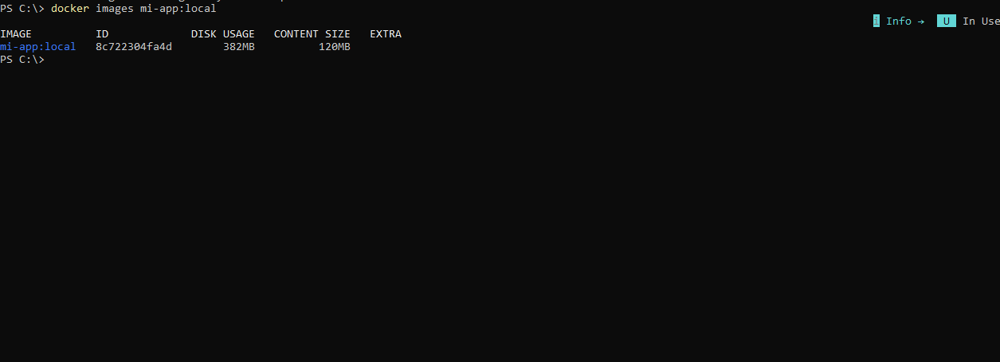
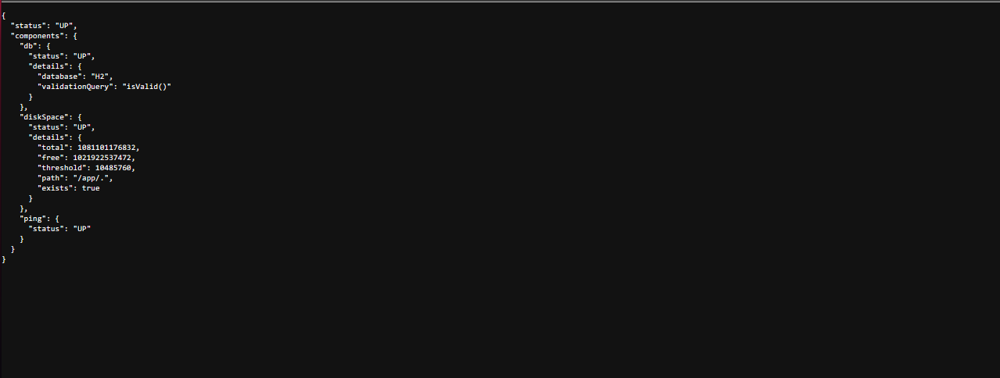
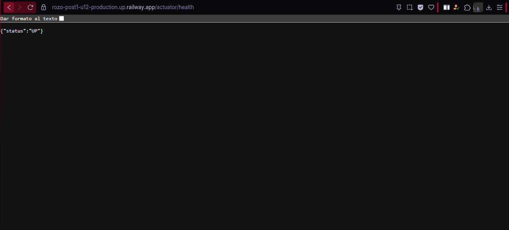
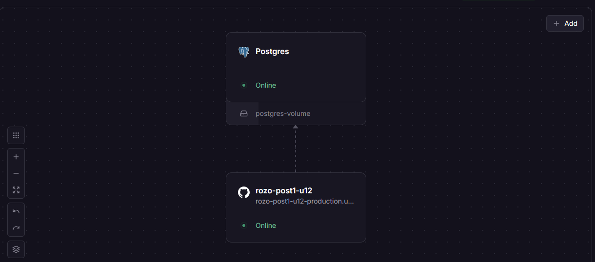
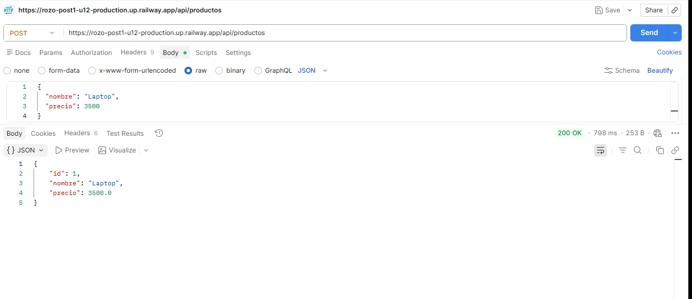
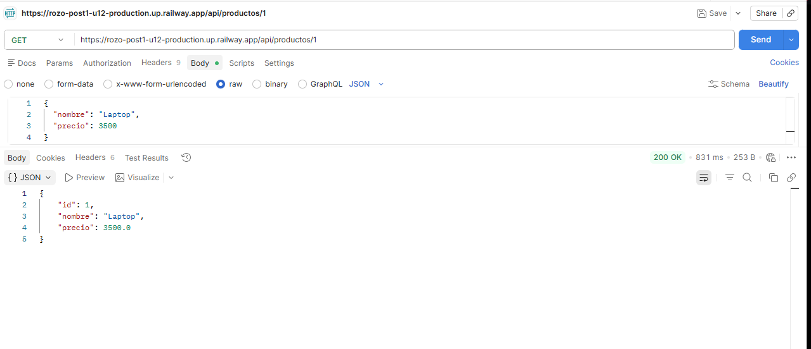

# Módulo de Contenedorización y Despliegue en Spring Boot

## Autor

**Nombre:** Jhoseth Esneider Rozo Carrillo  
**Código:** 02230131027  
**Programa:** Ingeniería de Sistemas  
**Unidad:** Unidad 12 – Despliegue y CI/CD
**Actividad:** Post-Contenido 1
**Fecha:** 16/05/2026

---

## Descripción del Proyecto

Este proyecto implementa la contenedorización y orquestación local de una aplicación Spring Boot para un sistema de gestión de productos.

Se integran mecanismos modernos de despliegue como:

- Dockerfile Multi-Stage para optimizar el tamaño de las imágenes.
- Docker Compose para orquestar la aplicación junto a PostgreSQL.
- Railway para el aprovisionamiento en la nube y despliegue continuo.

El objetivo es garantizar que la aplicación funcione de manera consistente en desarrollo y en producción, asegurando que la base de datos se despliegue de forma automática con las variables de entorno correctas.

---

## Objetivo

Implementar un sistema de contenedorización que permita:

- Crear imágenes Docker eficientes y seguras.
- Orquestar la aplicación localmente simulando el entorno de producción.
- Verificar el estado de salud de los servicios con Actuator.
- Desplegar la API REST en la plataforma Railway.

---

## Prerrequisitos

Antes de ejecutar el proyecto, asegúrate de tener:

- Docker Desktop instalado y en ejecución.
- JDK 21+ instalado en caso de querer compilar localmente (opcional).
- Maven 3.8+ o utilizar el `mvnw` incluido.
- Cuenta gratuita en Railway (railway.app) conectada a GitHub.

---

## Dependencias

```xml
<dependencies>
    <!-- Dependencias de Spring Boot Web y JPA -->
    <dependency>
        <groupId>org.springframework.boot</groupId>
        <artifactId>spring-boot-starter-web</artifactId>
    </dependency>
    <dependency>
        <groupId>org.springframework.boot</groupId>
        <artifactId>spring-boot-starter-data-jpa</artifactId>
    </dependency>

    <!-- Actuator para healthchecks -->
    <dependency>
        <groupId>org.springframework.boot</groupId>
        <artifactId>spring-boot-starter-actuator</artifactId>
    </dependency>

    <!-- Controladores de Base de Datos -->
    <dependency>
        <groupId>org.postgresql</groupId>
        <artifactId>postgresql</artifactId>
        <scope>runtime</scope>
    </dependency>
</dependencies>
```

**Arquitectura del Proyecto**

```text
 post1/
   ├── Dockerfile
   ├── docker-compose.yml
   ├── .dockerignore
   └── src/
       └── main/
           ├── java/com/ejemplo/app/
           │   ├── controller/ProductoController.java
           │   ├── model/Producto.java
           │   └── repository/ProductoRepository.java
           └── resources/
               ├── application.properties
               └── application-prod.properties
```

## Funciones principales:

- `getAllProductos()` → Recupera todos los productos de la BD.
- `createProducto()` → Almacena un producto nuevo.
- `/actuator/health` → Verifica estado de conexión de BD.

---

## Componentes de Despliegue y Arquitectura

### 1. Dockerfile Multi-Stage

Archivo que compila la imagen en dos fases separadas (Builder y JRE).

- **Decisión de diseño:**
  Se usa Multi-Stage para evitar que herramientas como Maven y el código fuente residan en la imagen final de producción, dejándola en menos de 300 MB y siendo una práctica de seguridad fuerte.

### 2. Docker Compose y Healthchecks

Archivo que orquesta `app` y `db` en una red aislada local.

- **Decisión de diseño:**
  Se eligió el condicional `condition: service_healthy` para el contenedor de la aplicación, asegurando que Spring Boot no intente conectarse a PostgreSQL hasta que la BD esté inicializada.

### 3. Perfiles de Spring Boot (`application-prod.properties`)

Centraliza la inyección de variables sensibles.

- **Decisión de diseño:**
  Se exteriorizan credenciales (`${DATABASE_URL}`, `${DB_USER}`) para no subir contraseñas al repositorio y facilitar el despliegue automático en Railway.

---

## Ejecución del Proyecto

1. Clonar repositorio:

```bash
git clone https://github.com/jerc31/rozo-post1-u12.git
```

2. Abrir terminal en la carpeta raíz y construir:

```bash
docker compose up -d --build
```

3. Verificar que los contenedores están `healthy`:

```bash
docker compose ps
```

4. Probar flujo completo:

- Llama a `http://localhost:8080/actuator/health`.
- Crea un producto haciendo un POST a `http://localhost:8080/api/productos`.

---

## Checkpoints de Despliegue

✓ **Checkpoint 1: Construcción Optimizada**

Comandos usados:

```bash
docker build -t mi-app:local .
docker images
```

_Se verifica que la imagen compila y pesa menos de 300MB._

✓ **Checkpoint 2: Orquestación Local**

Se levanta con Docker Compose y se verifica:

```bash
curl http://localhost:8080/actuator/health
```

_Retorna `{"status":"UP"}` con conexión a Postgres._

✓ **Checkpoint 3: Despliegue en Railway**

- Acción: Repositorio conectado a Railway y Postgres aprovisionado.
- Verificación: URL pública accesible.

---

## Flujo Completo de Despliegue

- Se realizan cambios de código local.
- Se compila y testea con `docker compose` en ambiente aislado.
- Se hace un `git push` al repositorio principal.
- Railway detecta el cambio, construye el Dockerfile en sus servidores y despliega.
- La aplicación de producción se conecta automáticamente a la base de datos aprovisionada por Railway.

## Decisiones de Diseño de CI/CD

✔ Uso de caché de capas en Docker (copiando `pom.xml` primero).
✔ Usuario `non-root` en el contenedor de producción.
✔ Uso de red aislada (`app-net`) en Docker Compose.
✔ Healthchecks explícitos usando `pg_isready`.
✔ Configuración condicional mediante perfil `prod`.

---

## Capturas del Proyecto

Las siguientes capturas se encuentran en la carpeta `/evidencias/`

### Archivo Dockerfile Construido



### Docker Compose



### Railway Despliegue



### Panel Railway



### Endopoint crear producto



### Endpoint obtener producto por id


